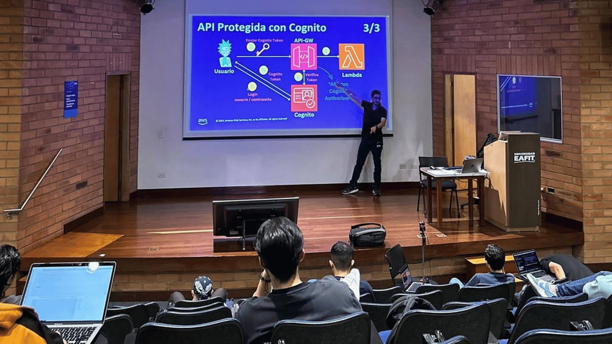
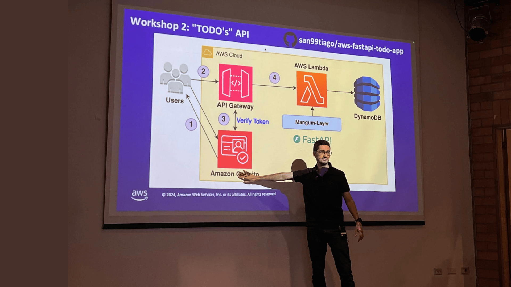
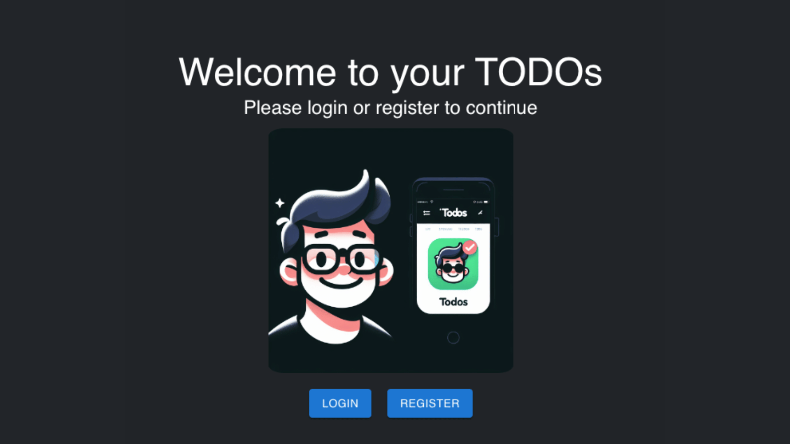
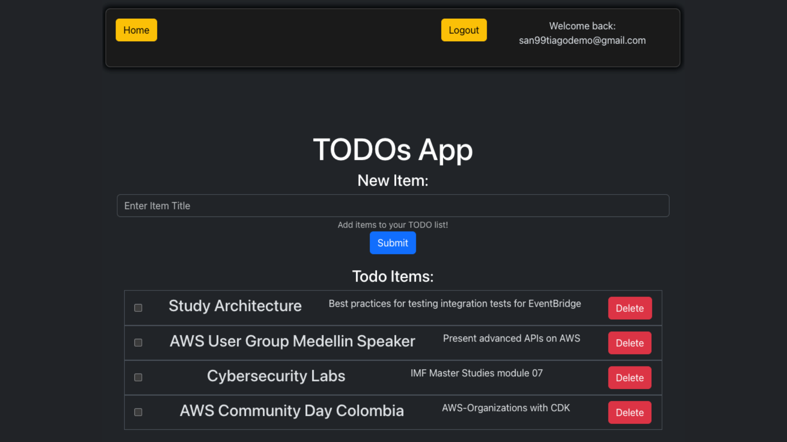

# 🎺 AWS-FASTAPI-TODO-APP 🎺

Advanced TODO App: A Fullstack AWS-Deployed Solution with Decoupled Architecture and Multi-User Capabilities

## Video Recording 🎥

- [YouTube Recording: Advanced APIs on AWS with FastAPI](https://youtu.be/j7REV2ZO_Ec)

## Event Pictures 💥

Here are some cool images when hosting the live event for the [AWS User Group Medellin](https://www.meetup.com/aws-medellin/):

 

 

## Overview 🔮

- Backend Source Code with [AWS Lambda Functions](https://aws.amazon.com/lambda/) built with [Python Runtime](https://www.python.org).
- Backend API Framework with [FastAPI](https://fastapi.tiangolo.com).
- [DynamoDB](https://aws.amazon.com/dynamodb/) used as the database (NoSQL) approach with [Single Table Design](https://aws.amazon.com/blogs/compute/creating-a-single-table-design-with-amazon-dynamodb/).
- Frontend Source Code with [React + Vite](https://vitejs.dev).
- Frontend deployed as a static website on an [S3 Bucket](https://aws.amazon.com/s3/).
- Authentication and Authorization with multiple options:
  - API Keys.
  - Cognito User Pool.
- Infrastructure as Code with [AWS CDK-Python](https://aws.amazon.com/cdk/) or [Terraform](https://www.terraform.io)
- Tests with [PyTest Framework](https://docs.pytest.org/)
- Dependencies and Environments managed with [Python Poetry](https://python-poetry.org)

  

This project was created to show how to easily deploy a Fullstack production-grade application on AWS by:

- Backend: leveraging one of the fastest Python frameworks in the market, FastAPI, while still gaining the power or AWS serverless tools, such as API-Gateway, Lambda Functions, DynamoDB, Cognito and more!
- Frontend: using S3 Bucket hosting to enable an static-website user interface on top of React. (Note: for production grade UIs, a DNS+CloudFront+ACM is recommended to be added).

The information of this repository is based on different public online resources, so feel free to use it as a guide for your future projects!.  

## How to run this project? 🎩

All projects are well commented (even over-commented sometimes for clarity).  

The required commands to deploy/destroy the solution can be found at:

- CDK-Deployment: [`cdk/important_commands.sh`](cdk/important_commands.sh)
- Terraform-Deployment: [`terraform/important_commands.sh`](terraform/important_commands.sh)

> Note: please update the commands based on your needs (account, region, etc...)

## Infrastructure as Code :cloud:

This project offers 2 options for managing the infrastructure:

- [AWS Cloud Development Kit](https://aws.amazon.com/cdk/)
- [Terraform](https://www.terraform.io)

Both are excellent IaC solutions, but depending on the use-case you can choose one or the other.  

## Dependencies ✋

The dependencies are explained in detail for each project, but the most important ones are Node, Python and the Infrastructure as Code solution (AWS-CDK or Terraform).  

### Software dependencies (based on project)

- [Visual Studio Code](https://code.visualstudio.com/)  
  Visual Studio Code is my main code editor for high-level programming. This is not absolutely necessary, but from my experience, it gives us a great performance and outstanding extensions to level-up our software development.  

- [NodeJs](https://nodejs.org/en/)  
  NodeJs is a JavaScript runtime built on Chrome's V8 JavaScript engine programming language. The community is amazing and lets us handle async functionalities in elegant ways. In this case, we need it for the main "CDK" library, that is built on top of NodeJS. 

- [Python](https://www.python.org/)  
  Python is an amazing dynamic programming language that allow us to work fast, with easy and powerful integration with different software solutions. We will use the Python CDK libraries. 

### Libraries and Package dependencies (depending on the scenario)

- [AWS CLI](https://aws.amazon.com/cli/)  
  The AWS Command Line Interface (AWS CLI) is a unified tool to manage your AWS services. We will use it for connecting to our AWS account from the terminal (authentication and authorization towards AWS).  

- [CDK CLI (Toolkit)](https://docs.aws.amazon.com/cdk/v2/guide/cli.html)  
  To work with the CDK, it is important to install the main toolkit as a NodeJs global dependency. Then, feel free to install the specific language AWS-CDK library (for example: [aws-cdk.core](https://pypi.org/project/aws-cdk.core/)).  

- [Terraform](https://www.terraform.io)  
  Terraform is one of the most important Infrastructure as Code solutions on the market. It is multi-cloud and has a big community for different cloud-based providers.

## Special thanks 🎁

- Thanks to all contributors of the great OpenSource projects that I am using.  

## Author 🎹

### Santiago Garcia Arango

<table border="1">
    <tr>
        <td>
            
Curious DevOps Engineer passionate about advanced cloud-based solutions and deployments in AWS. I am convinced that today's greatest challenges must be solved by people that love what they do.

        </td>
        <td>
            

        </td>
    </tr>
</table>

## LICENSE

Copyright 2024 Santiago Garcia Arango.
